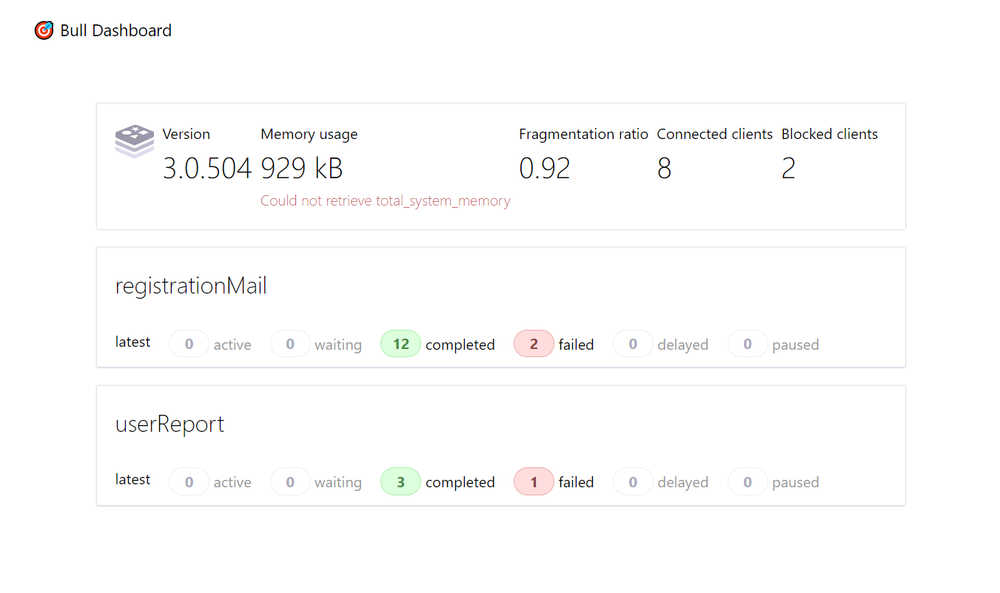

<h3>Techs:</h3>
<ol>

<li>NodeJS</li>
<li>Express</li>
<li>Redis</li>
<li>Bull</li>
<li>NodeMailer</li>

</ol>

<h4>Should create a .env file at the source.</h4>

<p>.env e.g:</p>

```env
MAIL_HOST = 'yourHost'
MAIL_PORT = 0000
MAIL_USER = 'user'
MAIL_PASS = 'password'

REDIS_HOST = 'yourHost'
REDIS_PORT = 6379
```

<h4 style="margin-bottom: 10px">I also applied the bull-board middleware on the server:</h4>

```
GET - /admin/queues
```

</img>
